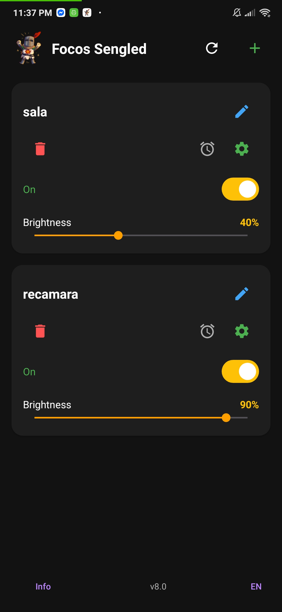
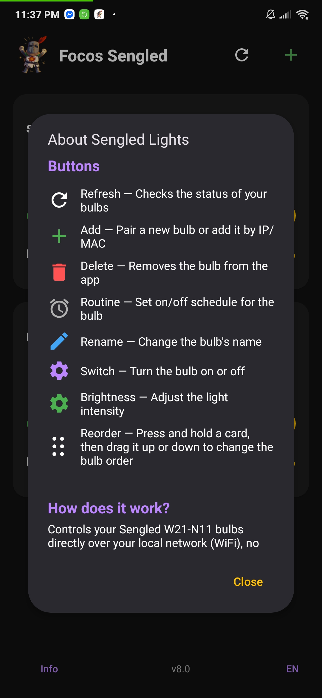

# Sengled Control — Local Sengled Bulb Control

**Sengled smart bulbs, under your own roof. No cloud. No accounts. No Internet required.**



When Sengled discontinued these bulbs, their cloud died — and with it, the official app. This project reverse-engineers the local Sengled UDP protocol and gives you a native Android app that talks directly to each **Sengled W21-N11** white bulb (EMW3091 module, fixed 2700K) over your LAN (UDP port 9080). Discontinued hardware, kept alive — 100% local, 100% yours.

## What's in this repo

| Folder | What it is |
|---|---|
| `SengledApp/` | **Android app** (Kotlin, Material 3) that controls your bulbs from your phone |

> **SengledTools** (Python tooling, web panel, pairing wizard, Home Assistant integration, protocol docs) lives in its **own repository** — it is a fork of the community project [`HamzaETTH/SengledTools`](https://github.com/HamzaETTH/SengledTools). The local clone is kept out of this repo (see `.gitignore`) so each repository keeps its own history and upstream.

## SengledApp — Android app

Native app (minSdk 24, targetSdk 34) that talks directly to each bulb over UDP. Features:

- **Per-bulb cards** with ON/OFF switch and brightness slider (1–100)
- **Real status per bulb** on open: *Prendida* (on) / *Apagada* (off) / *Sin conexión* (offline)
- **Daily routines per bulb with their own brightness** (e.g. ON at 19:30 at 7% brightness, OFF at 00:00)
- **Catch-up when you come home**: when the phone reconnects to the home Wi-Fi, the app re-applies the routine idempotently (the lamp turns on by itself without a state query)
- Rename bulbs, network-change notifications, diagnostics in the toolbar



### Build

```powershell
cd SengledApp
$env:JAVA_HOME = "C:\Program Files\Eclipse Adoptium\jdk-17.x"
.\gradlew.bat assembleDebug --no-daemon
```

On Linux/macOS use `./gradlew assembleDebug`. Requires Java 17 (AGP 8.5.2). APKs land in `SengledApp/app/build/outputs/apk/debug/`.

### Network requirements

- Phone must be on the **same LAN** as the bulbs (UDP port 9080).
- **Static IP per bulb** is recommended (reserve them in your router's DHCP) so routines keep working after router restarts.
- Bulb IPs are defined in `SengledApp/app/src/main/java/com/sengled/control/BulbRegistry.kt`.

## SengledTools — Python tooling (separate repo)

The Python tooling lives in the local `SengledTools/` folder, which is a fork of the community project [`HamzaETTH/SengledTools`](https://github.com/HamzaETTH/SengledTools):

- `sengled_tool.py` — CLI to control/diagnose bulbs, Wi-Fi pairing wizard
- `sengled-web.py` — local web panel with one card per bulb
- `sengled/wifi_setup.py` — full provisioning flow (connect to the bulb's AP, scan networks, send encrypted credentials)
- `custom_components/sengled_udp/` — Home Assistant integration over local UDP
- `docs/` — reverse-engineered protocol references: UDP, MQTT, Wi-Fi pairing

The `sengled-pair.ps1` and `start-sengled-web.bat` helper scripts at the root require that local fork (including its `.venv`).

## Security

- **No credentials live in this repository.** Wi-Fi passwords are entered at runtime (pairing) or kept in environment variables; MQTT certificates and private keys are excluded via `.gitignore`.
- Everything runs on your LAN; the bulbs never touch external servers unless you run the cloud-related pairing steps.
